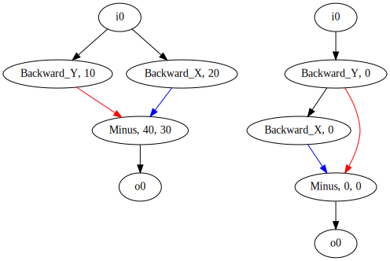

# wavegp

```
$ python build.py a.raw
$ python read.py a.raw
n_genes =  2
  0: input
  1: Backward_Y [10] 0 *
  2: Backward_X [20] 0 *
  3: Minus [40, 30] 1 2 *
 11: output 3

  0: input
  1: Backward_Y [0] 0 *
  2: Backward_X [0] 1 *
  3: Minus [0, 0] 1 2 *
 11: output 3

$ python graphviz.py a.raw a.gv
graphviz.py: a.gv
```

Convert to images

```
$ gvpack -u a.gv | dot -Tsvg -o img/a.svg
```



```
$ python execute.py
  0: input
  1: Backward_Y [] 0 *
  2: Backward_X [] 0 *
  3: Minus [] 1 2 *
 11: output 3
loss: 301

  0: input
  2: Backward_Y [] 0 *
 11: output 2
loss: 25

  0: input
  1: Backward_X [] 0 *
  2: Forward_X [] 1 *
  3: Backward_Y [] 0 *
  4: Forward_Y [] 3 *
  5: Plus [] 2 4 *
 11: output 5
loss: 0

  0: input
  1: Backward_Y [] 0 *
  2: Forward_Y [] 1 *
  3: Backward_X [] 0 *
  4: Forward_X [] 3 *
  5: Plus [] 2 4 *
 11: output 5
loss: 0
```

```
$ python lifting.py
  0: input
  1: Merge [] 0 0 *
  2: Even [] 1 *
  3: U [] 2 *
  6: U [] 3 *
  7: output 6
loss: 724

  0: input
  1: P [] 0 *
  7: output 1
loss: 922

  0: input
  1: Odd [] 0 *
  2: Even [] 0 *
  3: Minus [] 1 2 *
  4: U [] 3 *
  5: Plus [] 2 4 *
  6: Merge [] 5 3 *
  7: output 6
loss: 0
```


# References

- Julian Miller's CGP code
  [https://github.com/paul-kaufmann/cgp>

- <https://www.kartezio.com>
- <https://zenodo.org/records/3889163>
- <https://github.com/um-tech-evolution/CartesianGP.jl>

- CGP++
  [code](https://github.com/RomanKalkreuth/cgp-plusplus)
  [article](https://doi.org/10.1145/3638529.3654092)

- CGP-Library
  [code](https://github.com/AndrewJamesTurner/CGP-Library)
  [documentation](https://www.cgplibrary.co.uk)
  [article](http://andrewjamesturner.co.uk/files/GPEM2014.pdf)

- Miller, J. F. (2020). Cartesian genetic programming: its status and
  future. Genetic Programming and Evolvable Machines, 21(1), 129-168
  [10.1007/s10710-019-09360-6](https://doi.org/10.1007/s10710-019-09360-6)
